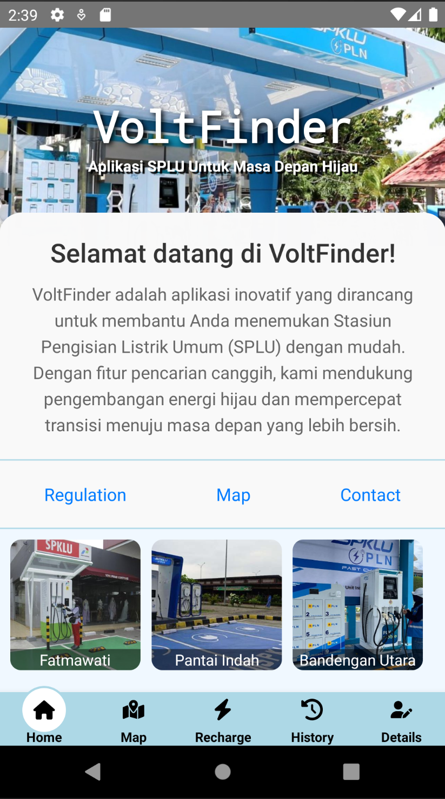
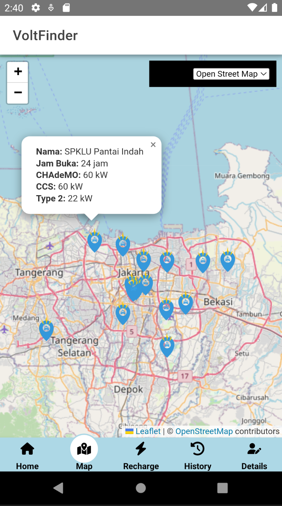
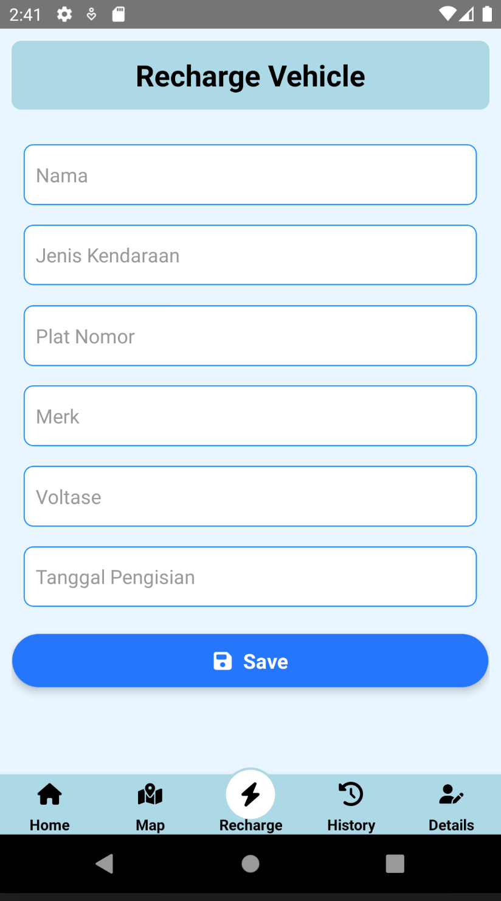
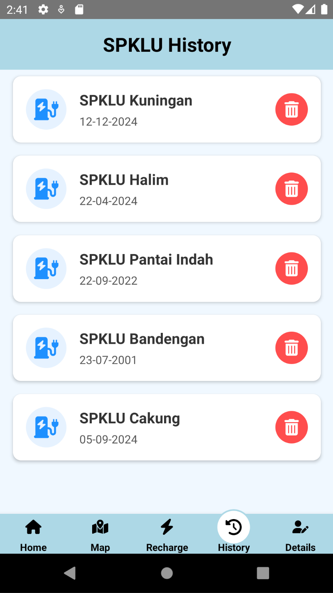
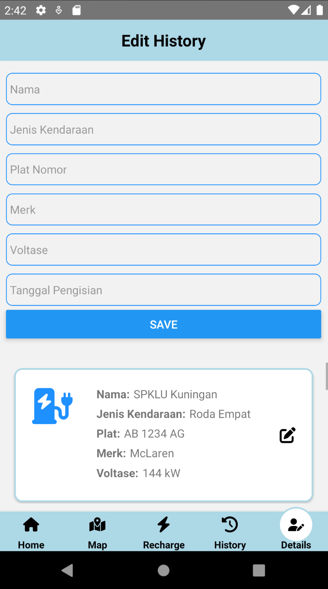

<h1 align="center">VoltFinder ⚡</h1>

    <em>VoltFinder merupakan aplikasi inovatif yang dirancang untuk membantu Anda menemukan stasiun pengisian kendaraan listrik umum (SPKLU) dengan mudah. Dengan fitur pencarian canggih dan pencatatan riwayat pengisian energi, kami mendukung pengembangan energi hijau dan mempercepat transisi menuju masa depan yang lebih bersih.</em>

---

<h3 align="center"><strong>Kenapa VoltFinder?</strong></h3>

    Kendaraan listrik adalah solusi utama untuk mengurangi polusi dan mendorong penggunaan energi terbarukan. Namun, keterbatasan SPKLU sering menjadi hambatan. <strong>VoltFinder</strong> hadir untuk mempermudah pencarian SPKLU, membuat perjalanan Anda lebih praktis dan ramah lingkungan.

    <strong>Mari bergabung dengan revolusi hijau dan nikmati kemudahan teknologi bersama VoltFinder!</strong>

---

<h2>Komponen Pembangun</h2>
<ul style="list-style-type:circle;">
    <li>React Native</li>
    <li>Ionic Framework</li>
    <li>Leaflet.Js</li>
    <li>Node.Js</li>
</ul>

---

<h2>Sumber Data</h2>
<ul style="list-style-type:square;">
    <li>Google Maps</li>
    <li>Wesite ESDM</li>
</ul>

---

<h2 align="center">Tampilan Aplikasi</h2>

    
    
    
    
    

---

<h2 align="center">Fitur Utama</h2>

    <strong>VoltFinder</strong> menyediakan berbagai fitur yang memudahkan penggunanya:

<ul style="list-style-type:disc; text-align:center;">
    <li>Pencarian SPKLU terdekat dengan peta interaktif</li>
    <li>Riwayat pengisian energi yang mudah diakses</li>
    <li>Informasi tentang stasiun pengisian terbaru</li>
    <li>Antarmuka yang ramah pengguna dan intuitif</li>
</ul>

---

<h2 align="center" style="color:#28a745;">Gabung Sekarang!</h2>

    <strong>Gunakan VoltFinder dan nikmati perjalanan Anda dengan kendaraan listrik yang lebih efisien dan ramah lingkungan!</strong>

